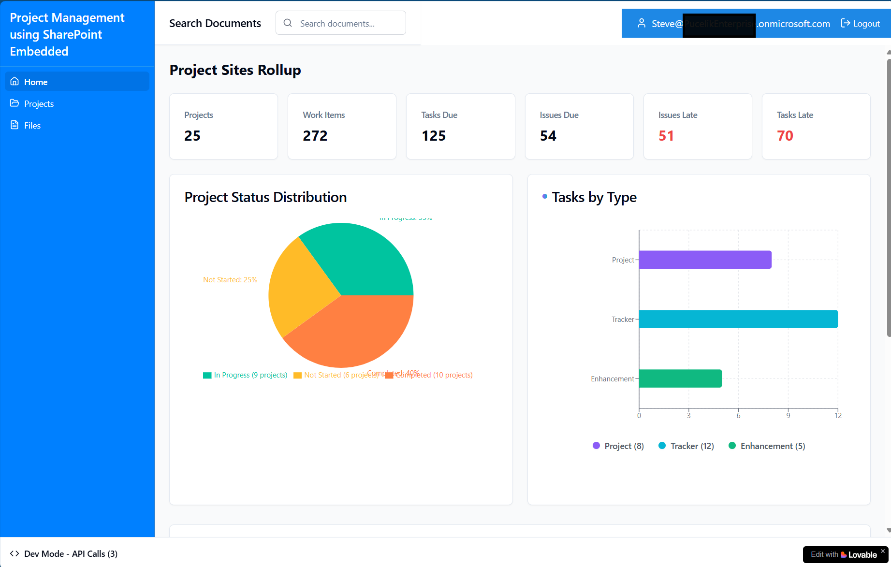
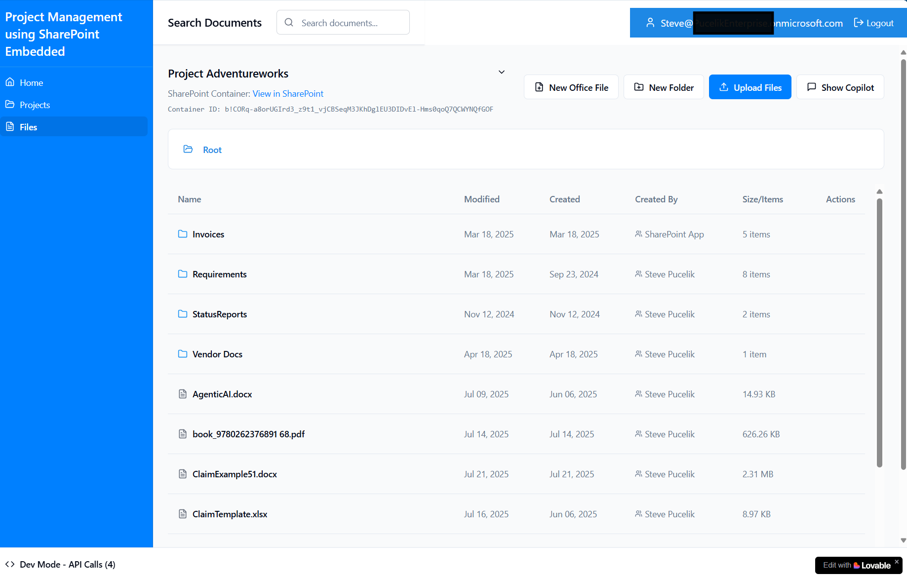
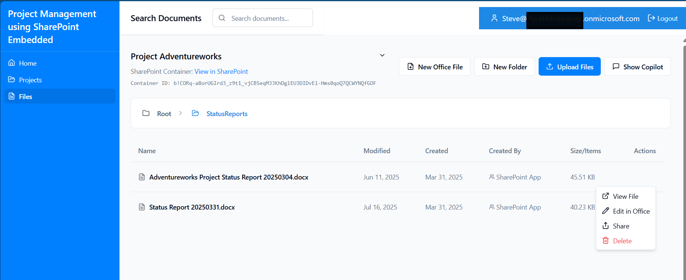

## Project information
This sample application simulates a common project management use case where documents need to be collabarated on by internal and external project teams.  

View project dashboard information:



Navigate into the projects you have access and begin to collaborate with other project members.



Experience full Microsoft Office collaboration right wihtin your application.



## Getting started

**Use your preferred IDE**

If you want to work locally using your own IDE, you can clone this repo and push changes. 

The only requirement is having Node.js & npm installed - [install with nvm](https://github.com/nvm-sh/nvm#installing-and-updating)

Follow these steps:

```sh
# Step 1: Clone the repository using the project's Git URL.
git clone <YOUR_GIT_URL>

# Step 2: Navigate to the project directory.
cd <YOUR_PROJECT_NAME>

# Step 3: Install the necessary dependencies.
npm i

# Step 4: Start the development server with auto-reloading and an instant preview.
npm run dev
```

**Connect to SharePoint Embedded**

It is assumed that you have a SharePoint Embedded Container Type registered and a container created to hold documents.  If not follow this [install guide](https://aka.ms/spe-start).


## Application Configuration
Start using the application by updating the configuration with your SharePoint Embedded information.  This can be found in the /src/config/appConfig.ts

```sh
# Line 5-7:  Replace whats in brackets with your SharePoint Embedded information.
 
    clientId: "<CLIENT_ID>", // Replace with your application client ID
    tenantId: "<TENANT_ID>", // Replace with your tenant ID
    containerTypeId: "<CONTAINER_TYPE_ID>", // Replace with your container type ID

# Line 11:  Update your domain to authenticate properly

    sharePointHostname: "https://<Domain>.sharepoint.com",

# Line 16:  Update the Client ID 

    clientId: "<CLIENT_ID>", // Same as above
```

## What technologies are used for this project?

This project is built with:

- Vite
- TypeScript
- React
- shadcn-ui
- Tailwind CSS
